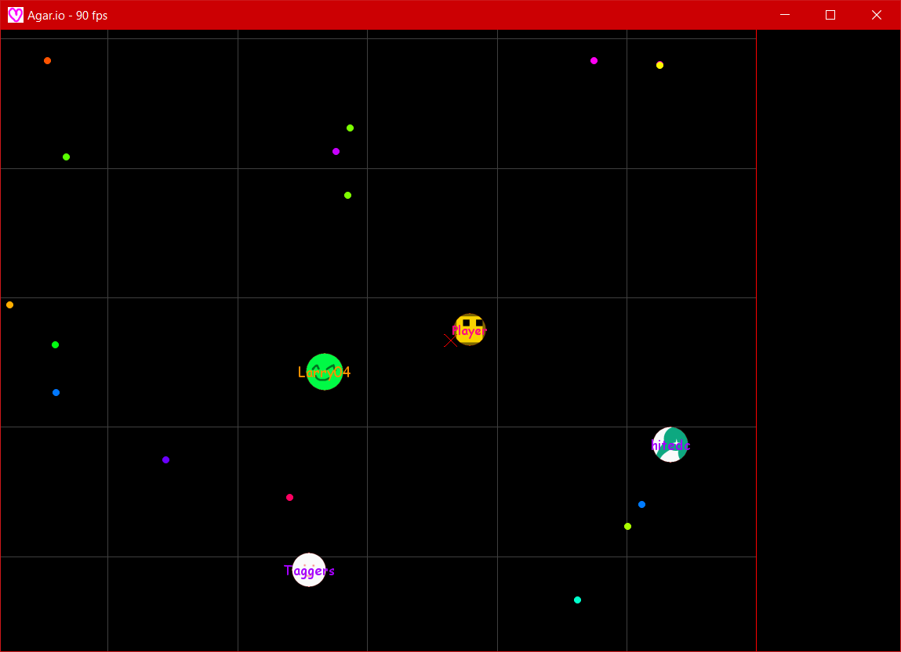

# CruCru.io, Projet VISI301 2019

### Principe du jeu

#### But

Manger les éléments plus petits que soi en évitant ceux plus gros que soi.

#### Comment jouer

* **Menu**
    * Assez explicite dans le jeu

* **Contrôles**
    * Vous contrôlez le joueur à la souris
    * Vous pouvez vous diviser en appuyant sur ```SPACE```
    * Pour quitter, maintenez la touche ```ESC``` enfoncée
    * Pour se mettre en plein écran, c'est la touche ```F11``` qu'il faut enfoncer

#### Comment lancer le jeu

Pour jouer à ce jeu, il vous faudra avoir installé Python (**≥ 3.7**) et pygame

Vous devrez ensuite exécuter le fichier ```./main.py```, soit par terminal / cmd / Powershell avec ```python main.py``` ou ```python3 main.py``` <br />
Certains paramètres sont modifiables dans le fichier ```./config.py``` <br />
Vous pouvez ajouter des skins dans le dossier ```./data/skins/```, avec éventuellement une description de ce skin dans le dossier ```./data/description/```<br />
Vous pouvez aussi ajouter des noms dans le fichier ```./data/usernames.txt```

### Aperçu

Vous pouvez voir dans la barre de titre le nombre d'images par secondes, qui peut facilement dépasser 300 (si les paramètres l'autorisent) sans que le jeu paraisse plus rapide (plus fluide par contre oui). <br /> 
Dans la fenêtre de jeu nous voyons le joueur au centre, quelques ennemis et de la nourriture (petites boules). <br />
À vous de télécharger notre jeu pour voir les buissons :kissing_heart:



### Crédits

@RomainTHD<br />
@crumiers
